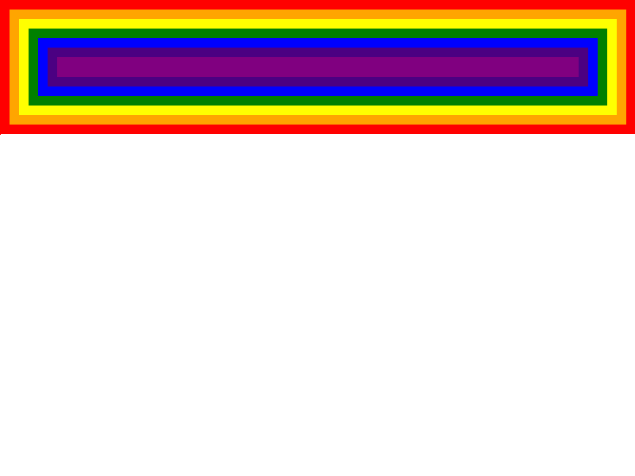

# Toy: Layout-Engine

a toy project based on "https://limpet.net/mbrubeck/2014/08/08/toy-layout-engine-1.html".

I plan to learn Rust & Browser Engine from this base project. So I create this repo. 

There are still amounts of features that need to be implemented.

# Result 

https://oanakiaja.github.io/layout-engine-toy/

## added feature
- export as wasm lib and be used in a real browser with canvas2d api. 

## TODO

- more DomNode Types
- more complex selectors
- dom inline style
- Inheritance
- cascade & user-agent style
- more css properties
- not by-hand html&css parser 
- error catch

